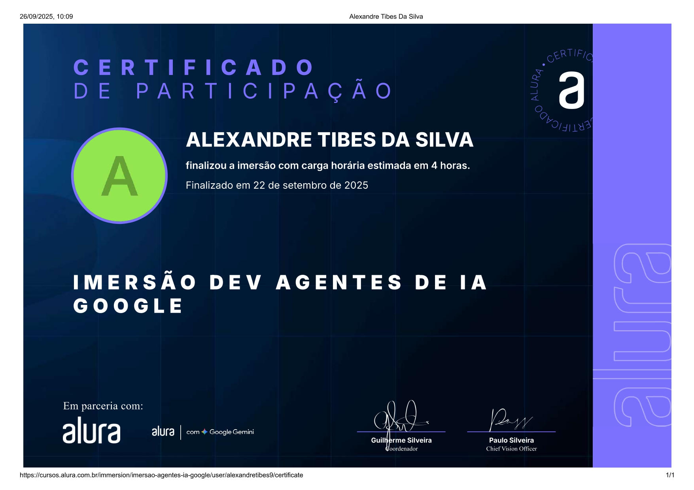

# Imersão Dev **Agentes de IA** – Alura

[](https://www.python.org/)
 
[]()
 
[](https://cursos.alura.com.br/)

📚 Repositório da **Imersão Dev – Agentes de IA (Alura)** com um agente para **consultar políticas internas** via **RAG** e **orquestração com LangGraph**, rodando no **Google Colab**.

---

## 📌 Sobre a Imersão

Neste curso foi construído um agente com a IA do Google Gemini que **recebe um pedido**, faz **triagem** e decide entre:

* **Responder** usando **RAG** (buscando trechos nas políticas em PDF),
* **Pedir mais informações**, ou
* **Abrir um ticket**.

**O que foi implementado (resumo):**

* **LLM (Gemini 2.5 Flash)** para triagem e respostas.
* **Carregamento de PDFs** (políticas da empresa) com **PyMuPDF**.
* **Split** com `RecursiveCharacterTextSplitter (300/30)`.
* **Embeddings** `models/gemini-embedding-001` + **FAISS** (retriever por *similarity score threshold* `0.3`, `k=4`).
* **RAG chain** com `create_stuff_documents_chain` e **citações** (doc, página, trecho).
* **LangGraph** com nós: `triagem → auto_resolver | pedir_info | abrir_chamado` e finais condicionais.

---

## 🧩 Diagramas

**Modelo geral do agente**


> * **Grafo A (fluxo do pedido)**: `pedido → agente → (responder com RAG | abrir ticket | pedir mais informações)`
> * **Grafo B (mapa de nós)**: grafo base usado para **definir nós** e depois **conectar** no **workflow**.

---

## 🔧 Tecnologias e Ferramentas

<div align="center">
  
  
  
</div>

---

## ▶️ Como rodar no **Google Colab**


1. **Abra** o notebook **`Imersão_Agentes_de_IA.ipynb`** no Colab.
2. **Instale** as dependências:

   * `langchain`, `langchain-google-genai`, `google-generativeai`
   * `langchain_community`, `faiss-cpu`, `langchain-text-splitters`, `pymupdf`
   * `langgraph`
3. **Defina a chave do Gemini** (no Colab):

   ```python
   from google.colab import userdata
   GOOGLE_API_KEY = userdata.get("GEMINI_API_KEY")  # ou defina manualmente via os.environ
   ```
4. **Suba os PDFs das políticas para o Colab**: o notebook carrega `*.pdf` do diretório **/content**.

   * No Colab (painel esquerdo) → **Upload** → envie os PDFs que estão na sua pasta local `docs/`.
5. **Execute as células** na ordem. O agente fará triagem e:

   * **AUTO\_RESOLVER** → responde com RAG + mostra **citações** (documento/página/trecho);
   * **PEDIR\_INFO** → lista **campos faltantes**;
   * **ABRIR\_CHAMADO** → retorna os **dados para abertura**.


---

## 🎯 Objetivo

Entregar um **assistente interno** simples e **confiável**, que respeita o conteúdo original das políticas e deixa claro quando **não sabe**.

---

## 📜 Certificado

<p align="center">
  
</p>

---

## 👤 Autor

**Alexandre Tibes da Silva (Xandetds)**

---
